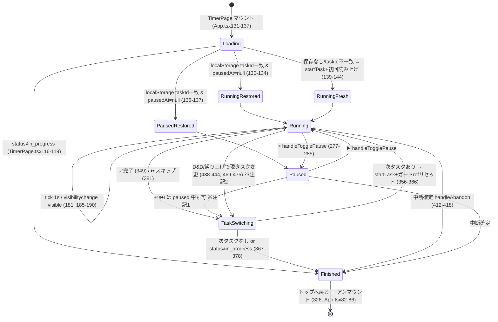
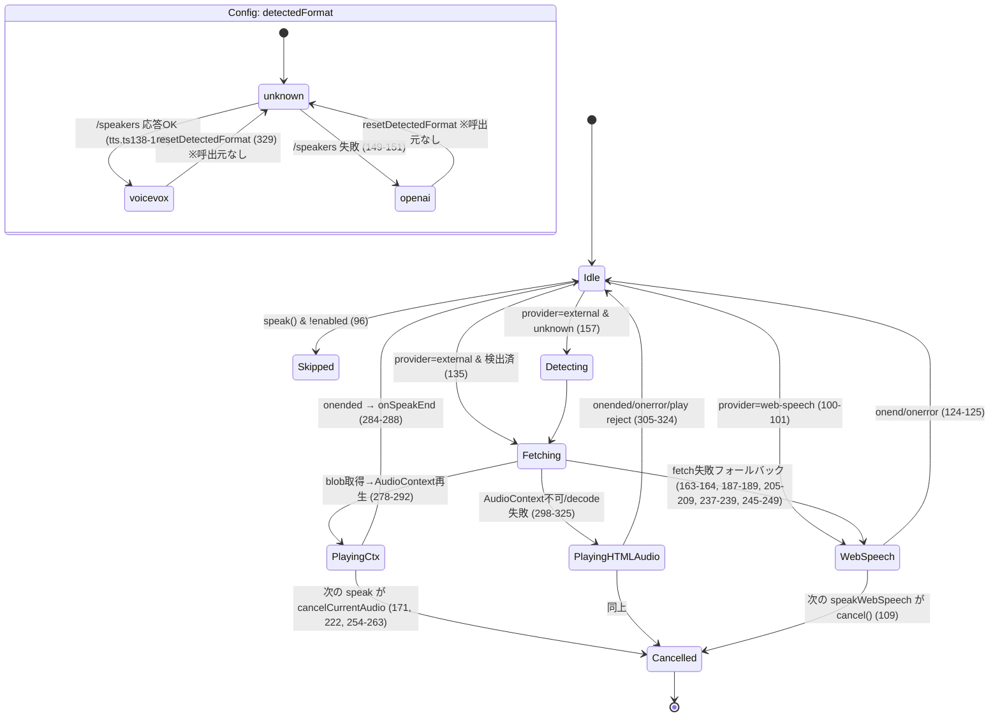
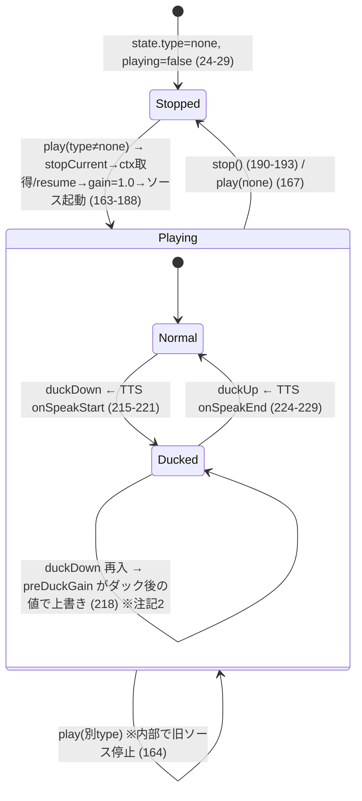

# routine-jikan 状態モデル文書（状態遷移整理班）

対象コミット時点: 2026-07-09 / branch develop
対象: `packages/web/src/pages/TimerPage.tsx`(676行), `lib/timerState.ts`(75行), `lib/tts.ts`(427行), `lib/ambient.ts`(233行), `hooks/useWakeLock.ts`(31行)。遷移起点として `App.tsx` / `StartPage.tsx` / `hooks/useApi.ts` も参照。
方針: 現状の記述のみ。バグ判定・改善提案はしない。「図に描けない遷移＝構造的曖昧さ」の指摘は成果物に含む。全項目に `相対パス:行` の根拠付き。ブラウザ実行順など、コードから確定できないものは **未確認** と明記。

---

## 1. サマリ

| 指標 | 数 |
|---|---|
| 状態変数（React useState） | **18**（TimerPage 10 / App 4 / StartPage 4） |
| 状態変数（React useRef） | **8**（TimerPage 7 / useWakeLock 1） |
| モジュールレベル可変変数 | **14**（tts.ts 7 / ambient.ts 7） |
| 永続化ストア | **3**（localStorage ×2 キー、sessionStorage ×1 キー） |
| useEffect | **11**（TimerPage 7 / App 2 / StartPage 1 / useWakeLock 1） |
| 遷移トリガー種別 | **6系統・計27個**（ユーザー操作 15 / tick 1 / useEffect 発火 11 のうち反応系 5 / API応答 6 / ページ遷移・リロード 3 / visibilitychange リスナー 3）※詳細 §3 |
| 暗黙ガード・暗黙遷移 | **24件**（§5 の一覧） |
| 図に描けない構造的曖昧さ | **7件**（§5-C） |

**本質的状態はごく少数**（サーバー側 execution + localStorage の TimerState + TTS/ambient 設定）で、残りの大半はそれらの**複製・導出・ガード用フラグ**。同じ事実が「React state / ref / localStorage / モジュール変数」の複数層に鏡写しで存在し、同期は特定のコードパスでのみ手動で行われている — というのが現状の構造。

---

## 2. 状態インベントリ（全数）

分類凡例:
- **本質**: 他から導出できない、システムの真実源
- **導出**: 他の状態から計算で再現できる
- **キャッシュ/複製**: 別の場所にある真実源のコピー（同期が必要）
- **ガード**: 遷移の重複発火防止・変化検出のためのフラグ
- **ハンドル**: リソース参照（interval ID、AudioNode 等）。状態機械の一部ではないが解放漏れが遷移に影響

### 2-1. TimerPage.tsx — useState（10個）

| # | 変数 | 行 | 型/初期値 | 分類 | 内容・真実源 |
|---|---|---|---|---|---|
| 1 | `execution` | TimerPage.tsx:37 | `ExecutionState \| null` = null | **キャッシュ** | サーバー実行状態のスナップショット。真実源はAPI（useApi.ts:169-182）。楽観的更新あり（:446-451, :477-482） |
| 2 | `elapsedSec` | :38 | number = 0 | **導出** | `calcTaskElapsedSec(timerStateRef.current)` の毎秒コピー（timerState.ts:72-75）。ただし handleComplete/handleSkip が導出を経ず直接 `setElapsedSec(0)` する（:354, :386） |
| 3 | `totalElapsedSec` | :39 | number = 0 | **導出** | 完了済タスク実時間合計 + 現タスク elapsed（:106-110, :151, :178） |
| 4 | `paused` | :40 | boolean = false | **複製** | 真実源は `timerStateRef.current.pausedAt !== null`（timerState.ts:13）。同期箇所は init（:135-137）と handleTogglePause（:277-285）のみ |
| 5 | `completed` | :41 | boolean = false | **複製** | 真実源は `execution.status !== 'in_progress'`。set箇所: :117, :377, :408, :416 |
| 6 | `ambientMuted` | :42 | boolean = false | **複製** | 真実源は ambient.ts:24 `state.muted`。同期は `setAmbientMuted(ambient.toggleMute())`（:629）の戻り値経由のみ |
| 7 | `wakeLockLog` | :50 | string[] = [] | 本質（デバッグ） | 直近10件のログ（:64 で slice(-9)+1） |
| 8 | `showDebug` | :51 | boolean = false | 本質（UI） | ルーチン名タップでトグル（:516） |
| 9 | `showTaskList` | :52 | boolean = false | 本質（UI） | 📋ボタンでトグル（:623） |
| 10 | `showAbandonConfirm` | :53 | boolean = false | 本質（UI） | 中断確認ダイアログ表示（:635, :645, :653, :659） |

### 2-2. TimerPage.tsx — useRef（7個）

| # | 変数 | 行 | 分類 | 内容 |
|---|---|---|---|---|
| 1 | `timerRef` | :43 | ハンドル | setInterval ID。張り直し: :181 / 解放: :194 |
| 2 | `lastSpokenRemaining` | :44 | **ガード** | 残り時間読み上げの重複防止（:219）。リセット箇所: :204, :360, :392, :442, :473 |
| 3 | `prevTaskId` | :45 | **ガード** | タスク切替の変化検出（:202）。書込箇所: :134, :141, :203, :358, :390, :440, :471（計7箇所） |
| 4 | `wakeLockRef` | :46 | ハンドル | WakeLockSentinel。取得: :79 / 解放: :76, :100 |
| 5 | `lastSpokenOvertime` | :47 | **ガード** | 超過読み上げの重複防止（:249）。リセット箇所: :205, :361, :393, :443, :474 |
| 6 | `spokenTimeUp` | :48 | **ガード** | 0到達読み上げ済みフラグ（:230, :234）。読取: :352, :384。リセット箇所: :206, :362, :394 の**3箇所のみ**（D&D/繰り上げ経路 :438-444, :469-475 ではリセットされない — §5-B-7） |
| 7 | `timerStateRef` | :49 | **キャッシュ** | localStorage `routine-jikan-timer-state` のインメモリ作業コピー。書込は全て timerState.ts 経由（write-through、§6）。書込箇所: :133, :140, :208, :280, :282, :357, :389, :439, :470（計9箇所） |

### 2-3. TimerPage.tsx — useMemo / useCallback（導出値・安定化関数）

| 変数 | 行 | 分類 | 内容 |
|---|---|---|---|
| `remainingTotalSec` | :258-263 | 導出 | pending タスクの planned 合計（deps: execution）※UI未使用でも定義されている |
| `estimatedEndTime` | :266-274 | 導出 | 現タスク残り + 将来 pending 合計から終了予定時刻。`Date.now()` を含むため毎秒変わる（deps: execution, elapsedSec） |
| `addLog` | :60-65 | 関数 | deps [] で安定 |
| `calcCompletedTasksSec` | :106-110 | 関数 | deps [] で安定 |
| `refresh` | :113-121 | 関数 | deps [startResult.executionId] で実質安定 |

### 2-4. lib/timerState.ts — localStorage `routine-jikan-timer-state`

| フィールド | 行 | 分類 | 内容 |
|---|---|---|---|
| `taskId` | timerState.ts:11 | **本質** | どのタスクのタイマーか（復元時の一致判定キー :131） |
| `taskStartedAt` | :12 | **本質** | タスク開始のms epoch。**唯一の時間の真実源**（interval は表示更新のみで加算しない） |
| `pausedAt` | :13 | **本質** | 一時停止時刻（null=実行中） |
| `pausedTotal` | :14 | **本質** | 一時停止の累積ms |

書込API: `startTask`（:41-50）/ `pauseTimer`（:53-57）/ `resumeTimer`（:60-69）— いずれも即 `saveTimerState`。読出: `loadTimerState`（:18-24）。削除: `clearTimerState`（:34-38）。導出: `calcTaskElapsedSec`（:72-75）。

### 2-5. lib/tts.ts — モジュールレベル変数（7個）

| # | 変数 | 行 | 分類 | 内容 |
|---|---|---|---|---|
| 1 | `config` | tts.ts:50 | **本質（設定）** | TTSConfig。localStorage `routine-jikan-tts` に write-through（:79-84）。うち `detectedFormat`/`speakerId` は**サーバー検出結果のキャッシュ**（:143, :150）で、`resetDetectedFormat`（:329-331）でのみ無効化（**現状UIから呼ぶ箇所なし** — grep で呼出0件、未使用エクスポート） |
| 2 | `onSpeakStart` | :53 | 本質（登録） | ダッキング開始コールバック。登録: TimerPage.tsx:155 |
| 3 | `onSpeakEnd` | :54 | 本質（登録） | ダッキング解除コールバック |
| 4 | `debugLog` | :57 | 本質（登録） | デバッグログコールバック。登録: TimerPage.tsx:156 |
| 5 | `currentAudio` | :61 | ハンドル | HTMLAudioElement フォールバック再生の参照（:302, :307, :314, :321 で解放） |
| 6 | `ttsContext` | :64 | ハンドル（シングルトン） | TTS用 AudioContext。生成: :67-77。**破棄コードなし**（ページ生存中ずっと保持） |
| 7 | `currentSource` | :65 | ハンドル | 再生中 AudioBufferSourceNode。「latest-wins」の実体（:254-263 cancelCurrentAudio）。ただしキュー構造は存在しない（§5-C-3） |

### 2-6. lib/ambient.ts — モジュールレベル変数（7個）

| # | 変数 | 行 | 分類 | 内容 |
|---|---|---|---|---|
| 1 | `audioContext` | ambient.ts:17 | ハンドル（シングルトン） | 環境音用 AudioContext（TTS用 :tts.ts:64 とは**別インスタンス**）。破棄コードなし |
| 2 | `gainNode` | :18 | ハンドル | マスターゲイン。生成: :40-41 |
| 3 | `oscillatorNode` | :19 | ハンドル | **宣言と stopCurrent での解放（:51-54）のみ存在し、代入箇所がゼロ**（startTick :63-81 はローカル osc を使い代入しない）。常に null の死に状態 |
| 4 | `noiseNode` | :20 | ハンドル | wave/rain/whitenoise のソースノード（:93, :116, :143） |
| 5 | `tickInterval` | :21 | ハンドル | tick 音の setInterval ID（:67, :47-50 で解放） |
| 6 | `preDuckGain` | :22 | **キャッシュ** | ダッキング前の gain 値の記録（:218, :227）。play 時に 1.0 リセット（:176-179） |
| 7 | `state` (const object) | :24-29 | **本質** | `{type, volume, muted, playing}`。**永続化なし**（メモリのみ）。muted の UI 複製が TimerPage.tsx:42 |

### 2-7. hooks/useWakeLock.ts（App レベルで使用）

| 変数 | 行 | 分類 | 内容 |
|---|---|---|---|
| `wakeLockRef` | useWakeLock.ts:4 | ハンドル | App.tsx:37 で常時マウント。**TimerPage.tsx:46-103 に独自の Wake Lock 実装が別途あり、タイマー画面では2系統が同時に request する**（挙動はブラウザ依存、未確認）。こちらは失敗を握りつぶす（:12-14）、ログなし |

### 2-8. 遷移起点側の状態（参考: App.tsx / StartPage.tsx）

| 変数 | 行 | 分類 | 内容 |
|---|---|---|---|
| `page` | App.tsx:38 | **本質（ルーティング）** | 初期値は sessionStorage 復元（:25-34）?? home |
| `routines` | App.tsx:39 | キャッシュ | API ルーチン一覧 |
| `showSettings` | App.tsx:40 | 本質（UI） | 設定パネル開閉 |
| `ttsMode` | App.tsx:41-45 | **複製** | tts config（enabled+provider）のUI鏡。同期は `handleTtsChange`（:67-74）経由のみ |
| sessionStorage `routine-jikan-active-timer` | App.tsx:11 | **本質（セッション）** | StartResult の丸ごと保存。set: :89 / remove: :55, :60, :83 |
| `routine` / `costLevel` / `groupOverrides` / `loading` | StartPage.tsx:20-23 | 本質（画面ローカル） | 開始前の選択状態。TimerPage には StartResult 経由でのみ渡る |

---

## 3. 遷移トリガーの全数列挙

### 3-1. ユーザー操作（15）

| # | 操作 | 定義 | 変化する状態 |
|---|---|---|---|
| U1 | 🏁 開始 | StartPage.tsx:58-64 → App.tsx:88-91 | tts.unlock（AudioContext resume）→ API `startRoutine` → sessionStorage set → `page`=timer → TimerPage マウント（→ E2 初期化） |
| U2 | ✅ 完了 | TimerPage.tsx:349-379 | tts.unlock → API `completeTask` → `elapsedSec`=0 → API `getExecution` → 次タスクあり: timerStateRef=startTask(次)・prevTaskId・3ガードrefリセット・（未読なら）speakTaskEnd ／ なし: clearTimerState・speakTaskEnd・ambient.stop → `execution`=新 → 非in_progressなら clearTimerState・`completed`=true |
| U3 | ⏭️ スキップ | :381-410 | U2 と同構造（API が `skipTask`） |
| U4 | ⏸ 一時停止/▶️ 再開 | :277-285 | timerStateRef=pauseTimer/resumeTimer（localStorage write-through）→ `paused` トグル → E3 の interval 停止/再開 |
| U5 | 中断する（ボタン） | :635 | `showAbandonConfirm`=true |
| U6 | 中断確定 | :659 → handleAbandon :412-418 | `showAbandonConfirm`=false → API `abandonExecution` → clearTimerState → ambient.stop → `completed`=true → refresh()（execution 更新） |
| U7 | 中断キャンセル | :653 / 背景タップ :645 | `showAbandonConfirm`=false |
| U8 | タスク D&D 並べ替え | handleTaskDragEnd :420-455 | 現タスクが変わる場合: timerStateRef=startTask・prevTaskId・`elapsedSec`=0・lastSpoken×2リセット（**spokenTimeUp は非リセット**）→ `execution` 楽観更新 → API `reorderExecution` |
| U9 | タスク繰り上げ ⬆ | handlePromoteTask :457-485 | U8 と同構造 |
| U10 | 📋 タスク一覧トグル | :623 | `showTaskList` |
| U11 | 🔊/🔇 ミュート | :629 | ambient `state.muted` トグル → gain 即反映（ambient.ts:202-208）→ 戻り値で `ambientMuted` 同期 |
| U12 | デバッグ表示（ルーチン名タップ） | :516 | `showDebug` |
| U13 | トップへ戻る（完了画面） | :326 → App.tsx:82-86 | sessionStorage remove → `page`=home → TimerPage アンマウント → cleanup: ambient.stop・tts.stopKeepAlive（:165）、WakeLock release・リスナー解除（:99-102）、interval 解除（:193-196） |
| U14 | 履歴から再開 | App.tsx:93-117 | API 2本 → StartResult 再構築 → U1 後半と同じ |
| U15 | TTS 設定変更（ホーム⚙️） | App.tsx:67-74 | `ttsMode` + tts config（localStorage write-through） |

### 3-2. タイマー tick（1）

| # | トリガー | 定義 | 変化 |
|---|---|---|---|
| T1 | setInterval 1000ms | TimerPage.tsx:181 → updateElapsed :173-179 | `elapsedSec`・`totalElapsedSec` を timerStateRef から再計算。**状態機械を進めるのではなく表示を真実源に追従させる**（時間の実体は taskStartedAt との差分）。elapsedSec 変化が E5/E6/E7 の TTS 判定を毎秒駆動 |

### 3-3. useEffect 発火（11本、うち反応系5）

| # | effect | 行 | deps | 実質発火タイミング | やること |
|---|---|---|---|---|---|
| E1 | WakeLock | TimerPage.tsx:68-103 | [addLog]（安定） | マウント時のみ | request + visibilitychange リスナー登録（V1） |
| E2 | 初期化 | :124-166 | [refresh, calcCompletedTasksSec]（安定） | マウント時のみ | refresh → localStorage 復元 or 新規 startTask + 初回読み上げ → elapsed 即時反映。＋ダッキング/ログ callback 登録、ambient.play、tts.startKeepAlive。cleanup: ambient.stop, tts.stopKeepAlive |
| E3 | interval 管理 | :170-197 | [paused, completed, execution, calcCompletedTasksSec] | **execution が変わるたび** interval 張り直し。paused/completed で停止 | T1 の setInterval + visibilitychange リスナー（V2）登録 |
| E4 | タスク切替検出 | :200-209 | [execution?.currentTask?.id] | currentTask.id 変化時（＋ガード再判定） | prevTaskId 更新、lastSpoken×2 + spokenTimeUp リセット、timerStateRef=startTask（localStorage 書込）。**elapsedSec はリセットしない**（次 tick 任せ） |
| E5 | 残り時間読み上げ | :212-225 | [elapsedSec, execution?.currentTask, paused] | 毎秒 | remaining が 60/30/10 に**完全一致**したら speakRemaining |
| E6 | 0到達読み上げ | :228-240 | [elapsedSec, execution, paused] | 毎秒 | remaining<=0 && !spokenTimeUp → spokenTimeUp=true、speakTaskEnd(現, 次pending) |
| E7 | 超過読み上げ | :243-255 | [elapsedSec, execution?.currentTask, paused] | 毎秒 | overtime が 60/300/600 に完全一致したら speakOvertime |
| E8 | セッション復元検証 | App.tsx:48-65 | []（eslint-disable） | App マウント時のみ | page=timer なら API 確認、非 in_progress で sessionStorage remove + home |
| E9 | ルーチン一覧取得 | App.tsx:80 | [refreshRoutines] | マウント時 | routines 更新 |
| E10 | ルーチン詳細取得 | StartPage.tsx:25-35 | [routineId] | マウント/ID変化時 | routine + groupOverrides 初期化 |
| E11 | App WakeLock | useWakeLock.ts:6-30 | [] | App マウント時 | request + visibilitychange リスナー（V3） |

### 3-4. API 応答（6）

| # | API | 呼出元 | 応答が変える状態 |
|---|---|---|---|
| A1 | `getExecution`（refresh 経由） | TimerPage.tsx:113-121（E2, U6） | `execution`、非 in_progress なら `completed`=true + localStorage clear |
| A2 | `getExecution`（直接） | :355, :387（U2/U3 内） | `execution`、タスク切替の起点 |
| A3 | `completeTask` / `skipTask` / `abandonExecution` | :353, :385, :413 | サーバー側のみ（応答値未使用、await のみ） |
| A4 | `reorderExecution` | :454, :484 | サーバー側のみ（楽観更新が先行、失敗時のロールバックなし） |
| A5 | `getExecution` + `getRoutine` | App.tsx:96-98（U14） | StartResult 再構築 → page 遷移 |
| A6 | `getExecution`（復元検証） | App.tsx:52（E8） | 失敗/終了済で page=home + sessionStorage remove |

### 3-5. ページ遷移・リロード（3）

| # | イベント | 経路 |
|---|---|---|
| P1 | リロード（タイマー中） | App.tsx:25-34 で sessionStorage から page=timer 復元 → E8 で生存確認 → TimerPage 再マウント → E2 で localStorage の TimerState を taskId 一致時のみ復元（TimerPage.tsx:130-137）。詳細は §6 |
| P2 | TimerPage アンマウント | cleanup 3本: :99-102（WakeLock）、:165（ambient/keepAlive）、:193-196（interval/V2） |
| P3 | 新規タブ | sessionStorage はタブ単位なので page=home。localStorage の TimerState は残存（届く経路は U14 履歴再開のみ） |

### 3-6. visibilitychange / スリープ復帰（リスナー3本 + Wake Lock release イベント）

| # | リスナー | 行 | visible 時 | hidden 時 |
|---|---|---|---|---|
| V1 | TimerPage WakeLock | TimerPage.tsx:90-97 | WakeLock 再取得（旧を release してから :75-78） | ログのみ |
| V2 | TimerPage timer | :185-190 | tts.resumeContext（AudioContext resume）+ updateElapsed 即時再計算 | なし |
| V3 | App useWakeLock | useWakeLock.ts:17-21 | WakeLock 再取得 | なし |
| V4 | WakeLock `release` イベント | TimerPage.tsx:81-83 | —（OS/タブ非表示で発火、ログのみ。再取得はしない） | — |

※ V2 は E3 の依存配列により paused/completed 中はリスナー自体が存在しない（:171 early return で登録前に抜ける）。つまり**一時停止中にスリープ復帰しても AudioContext resume は走らない**（事実として記録）。

---

## 4. 状態遷移図

### (a) タイマー実行ライフサイクル（TimerPage）

**注記（図に載らない暗黙遷移）:**
1. `handleComplete`/`handleSkip` は `paused` を確認せず、リセットもしない（:349-410 に setPaused なし）。Paused 中にタスクを切り替えると「React 上は Paused、timerStateRef 上は新タスクが実行中（startTask は pausedAt=null で生成 timerState.ts:41-50）」という**2層の不整合状態**に入る。図の状態名では表現できない（§5-B-6）。
2. TaskSwitching は実際には独立した状態ではなく、**async ハンドラ実行中の過渡状態**。`setElapsedSec(0)`（:354）から `setExecution(nextState)`（:374）までの間、「elapsedSec=0 だが execution は旧タスク」というレンダリングが起こり得る（実際に起こるかは React のバッチングに依存、未確認）。
3. Running 内に「通常/超過（remaining<0）」の見た目上のサブ状態があるが、これは純粋な導出（:341-343）で遷移は持たない。
4. E4（:200-209）による startTask は、U2/U3/U8/U9 が全て手動で prevTaskId を先回り更新するため、**通常フローでは一度も発火しない**設計になっている（発火し得るのは execution が「ハンドラを経由せずに」変わった場合のみ。現コードで該当経路は確認できず＝実質デッドパスだが、削除はされていない）。

### (b) TTS ライフサイクル（tts.ts）

**注記:**
1. **「latest-wins キュー」と呼ばれているが、キュー構造は存在しない**。実体は「新しい speak が external 経路の**冒頭**で currentSource/currentAudio を止める」だけ（:171, :222）。キャンセルが fetch 開始時点で行われるため、fetch が並行すると両方再生される（§5-C-3）。
2. ダッキング連動: external では `onSpeakStart` を **fetch 前**に呼ぶ（:179, :223）ため、「音が出ていないのに ambient が下がっている」区間が存在する。Web Speech では utterance.onstart（:123）＝発声開始時。
3. `PlayingCtx.onended` は**キャンセルされた場合も発火**する（source.stop() でも onended は呼ばれる — Web Audio 仕様、未確認扱い）。その際 `currentSource === source` ガード（:285）で参照クリアはスキップされるが `onSpeakEnd`（:286）は無条件に呼ばれる。
4. フォールバック連鎖時（例: VOICEVOX 失敗→WebSpeech）は `onSpeakEnd`（:188）→ WebSpeech の `onSpeakStart`（:123）の順でダッキングが上下する。
5. `ttsContext` の suspended→running 遷移が別途直交して存在: unlock（:392-409、U1/U2/U3 のユーザー操作時）、startKeepAlive（:415-418、E2）、resumeContext（:424-427、V2）、playBlob 内 resume（:270-273）。suspend への遷移は OS/ブラウザ起因で**コード上に現れない（未確認）**。

### (c) ambient ライフサイクル（ambient.ts）

**注記:**
1. **muted は図と直交する軸**: `toggleMute`（:202-208）は playing/stopped と無関係に gain を 0/復元する。ただし duckUp は `preDuckGain` を復元する（:227）ため、「Ducked 中に mute→unmute→duckUp」の合成順によって gain の最終値が変わる。状態図で表現できない（gain 値がコールバック到着順に依存、§5-C-5）。
2. duckDown 再入（TTS フォールバック連鎖や連続発話）で preDuckGain が 0.2 倍後の値を記録し、以後の duckUp がその値までしか戻さない。play() の gain=1.0 リセット（:176-179）が「前回の duckUp 漏れ対策」とコメントされており、この事象が既知であることが読み取れる。
3. `state.volume` の反映タイミングは音源により異なる: tick は setInterval 内で毎回 `vol` を**クロージャで固定**（:64, :75）するため `setVolume` が効かず、wave/rain/whitenoise はソース生成時の noiseGain に固定（:98, :125, :153）。`setVolume`（:195-200）が触るのは**マスター gainNode のみ**で、これは play() で 1.0 に戻される。つまり実効音量 = (生成時 volume × 係数) × (マスター gain)。※setVolume の呼出元は現状 grep で0件（未使用エクスポート）。
4. AudioContext suspended→resume は play() 内（:171-173）のみ。TTS 側の resumeContext は**別の AudioContext**（tts.ts:64）を触るため ambient には効かない。

---

## 5. 暗黙ガード・暗黙遷移の全数一覧（再設計の主戦場）

### A. useEffect 内 early return（8件）

| # | 場所 | 条件 | 守っているもの |
|---|---|---|---|
| A1 | TimerPage.tsx:70-73 | `!('wakeLock' in navigator)` | 非対応環境 |
| A2 | :127 | `status !== 'in_progress' \|\| !currentTask` | 終了済み execution での初期化スキップ |
| A3 | :171 | `paused \|\| completed` | interval と V2 リスナーの生成自体を抑止 |
| A4 | :174 | `!timerStateRef.current \|\| !execution` | 初期化完了前の tick |
| A5 | :202 | `!currentTask \|\| currentTask.id === prevTaskId.current` | **タスク切替の変化検出（本丸）** |
| A6 | :214, :246 | `!currentTask \|\| paused` | pause 中の読み上げ抑止 |
| A7 | :230 | `!currentTask \|\| paused \|\| spokenTimeUp.current` | 0到達読み上げの1回制限 |
| A8 | App.tsx:49 | `page.type !== 'timer'` | 復元検証の対象限定（deps [] + eslint-disable :65 で「マウント時の page」のみ見る） |

### B. ref 比較・手動リセットによる変化検出（8件）

| # | 場所 | 仕組み |
|---|---|---|
| B1 | TimerPage.tsx:45, :202-203 | `prevTaskId.current` 比較 — タスク切替検出の中核。書込7箇所（:134, :141, :203, :358, :390, :440, :471）に分散 |
| B2 | :219, :249 | `lastSpokenRemaining/Overtime !== t` — 同一閾値の再読み上げ防止。`remaining === t` の**完全一致**判定とセット |
| B3 | :352, :384 | `alreadySpoken = spokenTimeUp.current` のローカルキャプチャ — 「0到達時に既に読んだか」を async 処理を跨いで持ち回る |
| B4 | :359-362, :391-394 | ハンドラ内の手動 ref リセット。コメントに「タスク切り替えuseEffectがガードで発火しないため」と明記 — **E4 と同じリセット処理が4箇所（E4/U2/U3/U8+U9）に複製**されている |
| B5 | :131 | `saved.taskId === state.currentTask.id` — localStorage 復元の一致ガード |
| B6 | :40 vs timerState.ts:13 | `paused`（React）と `pausedAt`（localStorage/ref）の**二重管理**。同期箇所は :135-137 と :277-285 のみで、U2/U3/U8/U9 の startTask 経路は React 側を触らない |
| B7 | :438-444, :469-475 | D&D/繰り上げのリセットは lastSpoken×2 のみで **spokenTimeUp を含まない**（U2/U3 は3つ全部リセット）。リセット対象の集合が経路ごとに異なる |
| B8 | tts.ts:135 | `detectedFormat !== 'unknown'` — 形式検出の1回制限（localStorage 永続のため**サーバー変更後も残る**） |

### C. 図に描けない遷移・構造的曖昧さ（7件）

| # | 内容 | 根拠 |
|---|---|---|
| C1 | **E2（init 本体）と E4（タスク切替 effect）の実行順が暗黙依存**。init 内の `await refresh()` は setExecution を先に行うため、E4 が「prevTaskId=null vs 新タスク」で発火し得る条件が一瞬成立する。実際には async 継続（microtask）が passive effect より先に走り prevTaskId が埋まる**ことに依存して**ガードされているが、この順序はコード上どこにも明示されていない（React のスケジューリング依存、未確認） | TimerPage.tsx:126, :133-134, :200-203 |
| C2 | **閾値判定が「完全一致」**（`remaining === t` :219、`overtime === t` :249）。elapsedSec は壁時計差分の導出（timerState.ts:72-75）なので、interval スロットリングや visibilitychange 再計算で**秒が飛ぶと閾値を通過しても発火しない**。一方 0到達（:233）は `<= 0` なので飛んでも発火する — 同種の判定で不一致な設計が併存 | TimerPage.tsx:219, :233, :249 |
| C3 | **TTS「latest-wins」はキューではなく早勝ちキャンセル**。cancelCurrentAudio は fetch **開始時**（tts.ts:171, :222）のみで、fetch 中の発話は互いに見えない。speak A→B が連続すると B の cancel 時点で A は未再生（currentSource=null）→ 両方 playBlob に到達し**同時再生**が可能。到達順はネットワーク依存で状態図に描けない | tts.ts:171, :222, :254-263, :278-292 |
| C4 | **ダッキングの対称性がコールバック到着順依存**。onSpeakStart/End の呼び出し回数は fetch 失敗・フォールバック連鎖・キャンセルの組み合わせで 1:1 にならない経路がある（例: :179 で down → :188 で up → fallback WebSpeech の :123 で再 down）。ambient 側は preDuckGain 1変数しか持たないため、ネストの深さを表現できない | tts.ts:179, :188, :123 / ambient.ts:215-229 |
| C5 | **ambient の実効音量が3层の掛け算**（生成時クロージャ固定 × ソース別係数 × マスター gain）で、単一の状態変数に対応しない。mute/duck/setVolume がそれぞれ別の層を触る | ambient.ts:64-75, :98, :125, :153, :176-179, :195-208 |
| C6 | **Wake Lock が2系統併走**（App の useWakeLock + TimerPage 独自実装）。同一ドキュメントで2つの sentinel を request した際の挙動はブラウザ依存（未確認）。release イベント（TimerPage.tsx:81-83）はログのみで再取得しないため、「visibilitychange を伴わない release」（例: バッテリー低下）後の状態は3系統目の暗黙状態になる | useWakeLock.ts:6-30, TimerPage.tsx:68-103 |
| C7 | **complete/skip ハンドラの async 途中状態**。`setElapsedSec(0)`（:354）→ await getExecution → `setExecution`（:374）の間に tick（T1）が走ると、updateElapsed が**旧 execution + 新 timerStateRef**で totalElapsed を計算する瞬間がある。連打時は2つの async ハンドラが交錯し得る（ボタンの disable なし :600-611）。順序はイベントループ依存で図に描けない | TimerPage.tsx:349-379, :173-179 |

### D. 複数 state の組で初めて意味を持つ状態（5件）

| # | 組 | 意味 | 根拠 |
|---|---|---|---|
| D1 | `completed && execution` | 完了画面。`completed=true && execution=null` は「読み込み中...」表示に落ちる（別の見た目） | TimerPage.tsx:288, :336-338 |
| D2 | `!execution \|\| !currentTask` | ローディング画面。ただし「execution あり・currentTask=null・非 completed」も同じ表示（abandon 直後の一瞬など） | :335-338 |
| D3 | `paused` × `timerStateRef.pausedAt` | 真の一時停止は両方一致時のみ。片方だけの状態が U2/U3 経由で作れる（§4a注記1） | :40, :277-285, timerState.ts:13 |
| D4 | `spokenTimeUp` × `remaining<=0` × `nextTask` | 「終了読み上げをどちらの経路（E6 or U2/U3）が担当するか」の分岐。alreadySpoken キャプチャ（:352, :384）を含め3値の組 | :228-240, :352-371 |
| D5 | `ambientMuted`（React）× `ambient state.muted` × `gainNode.gain.value` | UIアイコン・論理mute・実効音量の3層。同期点は :629 の1箇所 | TimerPage.tsx:42, :629, ambient.ts:24-34 |

---

## 6. 永続化と復元マトリクス

### 6-1. ストア一覧

| ストア | キー | 内容 | 書込タイミング | 削除タイミング |
|---|---|---|---|---|
| localStorage | `routine-jikan-timer-state` | TimerState（taskId/taskStartedAt/pausedAt/pausedTotal） | startTask/pauseTimer/resumeTimer の都度（write-through、timerState.ts:48, :55, :67） | ルーチン終了系 6箇所: TimerPage.tsx:118, :368, :376, :399, :407, :414 |
| localStorage | `routine-jikan-tts` | TTSConfig 全体（enabled/provider/voice/speakerId/detectedFormat/rate/pitch/volume/externalUrl） | setTTSConfig の都度（tts.ts:79-84）。検出結果も自動保存（:143, :150） | なし（上書きのみ） |
| sessionStorage | `routine-jikan-active-timer` | StartResult 丸ごと（ambient 種別/音量含む） | 開始時（App.tsx:89） | goHome（:83）、復元検証NG（:55, :60） |
| サーバー DB | execution | タスク状態・実績時間 | complete/skip/abandon/reorder API | —（真実源） |

### 6-2. リロード（同一タブ）時の復元マトリクス

| 状態 | 復元される? | 経路 | 条件・注記 |
|---|---|---|---|
| ページ（タイマー画面にいること） | ✅ | sessionStorage → App.tsx:25-34, :38 | E8 で API 生存確認、終了済なら home へ |
| 実行状態（タスク一覧・進捗） | ✅ | API 再取得（TimerPage.tsx:126） | サーバーが真実源 |
| 現タスクの経過時間 | ✅ | localStorage → :130-134 | **taskId 一致時のみ**。不一致なら startTask で0から（:139-141） |
| 一時停止中だったこと | ✅ | `saved.pausedAt !== null` → setPaused(true)（:135-137） | pausedTotal も保持され経過計算に反映 |
| ambient の種別・音量 | ✅（初期値に戻る形で） | sessionStorage の StartResult → :158-162 | ルーチンのデフォルト値。**セッション中の変更は元々ない**（setVolume 未使用） |
| ambient の mute | ❌ | ambient.ts:24-29 はメモリのみ | mute 中にリロードすると音が復活 |
| TTS 設定（provider/enabled/検出形式） | ✅ | localStorage → tts.ts:42-50 | モジュールロード時に読込 |
| TTS ガード（lastSpoken×2 / spokenTimeUp） | ❌ | ref 初期値に戻る（TimerPage.tsx:44-48） | 復元経路（:131-137）はガード ref を再現しない。超過中にリロードすると spokenTimeUp=false に戻り、**E6 が復帰直後に再度 speakTaskEnd を発火する**（:228-240、事実として記録）。通過済み閾値の再判定は完全一致式のため通常は再発火しない（elapsedSec が閾値秒をもう一度踏まない限り） |
| 初回タスク読み上げ | ❌（復元時は読み上げなし） | speakTaskStart は新規開始分岐（:144）のみ | 復元分岐（:131-137）に読み上げなし |
| UI フラグ（showDebug/TaskList/AbandonConfirm）・wakeLockLog | ❌ | useState 初期値 | |
| 再生中の TTS 音声 | ❌ | AudioContext ごと消滅 | |
| elapsedSec/totalElapsedSec | ✅（導出で再現） | :148-151 | |

### 6-3. スリープ復帰（リロードなし）時

| 状態 | 挙動 | 根拠 |
|---|---|---|
| 経過時間 | visible で即時再計算（壁時計差分なのでスリープ時間も進む） | TimerPage.tsx:185-190, timerState.ts:72-75 |
| Wake Lock | visible で再取得（2系統とも） | TimerPage.tsx:90-97, useWakeLock.ts:17-21 |
| TTS AudioContext | visible で resume 試行 | TimerPage.tsx:187, tts.ts:424-427 |
| ambient AudioContext | **復帰処理なし**（resume は play() 内のみ）。suspend されたままかはブラウザ依存（未確認） | ambient.ts:171-173 |
| paused 中の復帰 | V2 リスナー自体が未登録のため再計算も resume もされない | TimerPage.tsx:171 |
| スリープ中に通過した TTS 閾値 | 完全一致式のため発火しない（0到達のみ `<=0` で発火） | :219, :233, :249 |

### 6-4. 別タブ / タブ閉じ→再訪

- sessionStorage はタブ単位 → page=home 起動。localStorage の TimerState は残るが、TimerPage へ入る経路は履歴からの再開（U14）のみ。再開時に currentTask が一致すれば経過時間も復元される（TimerPage.tsx:130-134）。
- ルーチンを正常終了せず放置した場合、`routine-jikan-timer-state` は次の startTask（timerState.ts:48）まで残存する（clear は終了系6箇所のみ）。

---

## 7. 集計表（grep 突き合わせ）

grep パターン: `useState[<(]` / `useRef[<(]` / `useEffect(`（import 行を除外するため `(`/`<` 付きで検索）。

| ファイル | useState | useRef | useEffect | grep 結果との一致 |
|---|---|---|---|---|
| pages/TimerPage.tsx | **10**（:37-42, :50-53） | **7**（:43-49） | **7**（:68, :124, :170, :200, :212, :228, :243） | ✅ 一致（`useState(` 8件 + `useState<` 2件 = 10。`useRef` 7行 + import 行1 = grep 8行中 実体7） |
| App.tsx | 4（:38-41） | 0 | 2（:48, :80） | ✅ |
| pages/StartPage.tsx | 4（:20-23） | 0 | 1（:25） | ✅ |
| hooks/useWakeLock.ts | 0 | 1（:4） | 1（:6） | ✅ |
| **合計** | **18** | **8** | **11** | |

| モジュール変数 | 数 | 内訳 |
|---|---|---|
| lib/tts.ts | 7 | config, onSpeakStart, onSpeakEnd, debugLog, currentAudio, ttsContext, currentSource（tts.ts:50-65） |
| lib/ambient.ts | 7 | audioContext, gainNode, oscillatorNode（代入箇所ゼロ）, noiseNode, tickInterval, preDuckGain, state（ambient.ts:17-29） |

| その他カウント | 数 |
|---|---|
| TimerPage useMemo | 2（:258, :266） |
| TimerPage useCallback | 3（:60, :106, :113） |
| localStorage キー | 2（timerState.ts:8, tts.ts:40） |
| sessionStorage キー | 1（App.tsx:11） |
| visibilitychange リスナー | 3（TimerPage.tsx:98, :191, useWakeLock.ts:24） |
| prevTaskId 書込箇所 | 7（:134, :141, :203, :358, :390, :440, :471） |
| timerStateRef 書込箇所 | 9（:133, :140, :208, :280, :282, :357, :389, :439, :470） |
| clearTimerState 呼出箇所 | 6（:118, :368, :376, :399, :407, :414） |
| 未使用エクスポート（状態APIだが呼出0件） | tts.resetDetectedFormat / tts.getAvailableVoices / ambient.setVolume / ambient.isMuted / ambient.getState（プロジェクト内 grep で呼出なし。設定UI未実装分と推測されるが**用途はコードから確定できず未確認**） |

---

*作成: 状態遷移整理班（海音コウ） 2026-07-09。実装変更なし・読み取りのみ。*
